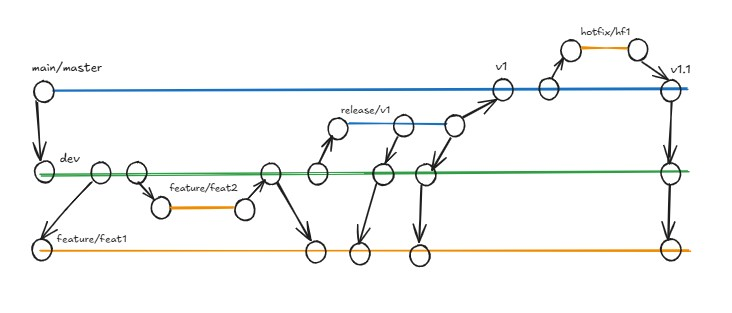

# GitFlow 

| **Author** | **Created on** | **Last updated by** | **Version** | **Last edited on** | **Internal Reviewer** | 
|------------|----------------|---------------------|-------------|--------------------|----------------------|
| Sharvari Khamkar | 13-02-25      | Sharvari Khamkar    | v1          | 13-02-25           | Komal Jaiswal        | 

## **Table of Contents**
1. [Introduction](#introduction)
2. [Why GitFlow?](#why-gitflow)
3. [GitFlow Workflow](#gitflow-workflow)
4. [Key Features of GitFlow](#key-features-of-gitflow)
5. [Advantages of GitFlow](#advantages-of-gitflow)
6. [Disadvantages of GitFlow](#disadvantages-of-gitflow)
7. [Conclusion](#conclusion)
8. [Contact Information](#contact-information)
9. [References](#references)

## Introduction
GitFlow is a branching model for Git that helps teams manage their software development process. It defines a structured way to handle features, releases, and bug fixes, making collaboration easier.

## Why GitFlow?
In large projects, multiple developers work on different features simultaneously. GitFlow helps:
- Keep the code organized
- Ensure a smooth release process
- Separate development and production code
- Allow parallel feature development

## GitFlow Workflow
GitFlow follows a structured branching strategy:
- Main Branches:
  - `main` (or `master`): Contains stable, production-ready code.
  - `develop`: Includes the latest development changes before merging into `main`.
- Supporting Branches:
  - `feature` branches: Used to develop new features.
  - `release` branches: Prepares code for production.
  - `hotfix` branches: Fixes urgent bugs in production.
  
### GitFlow Diagram:

## Key Features of GitFlow
- Well-organized branching strategy
- Supports parallel feature development
- Clear separation of development and production
- Helps in version control and releases
- Provides a structured workflow for teams

## Advantages of GitFlow
✅ Makes collaboration easier in teams  
✅ Provides a clear process for managing code  
✅ Reduces merge conflicts by keeping separate branches  
✅ Ensures production stability with structured releases and bug fixes  
✅ Works well for large-scale projects

## Disadvantages of GitFlow
❌ Can be complex for small projects  
❌ Requires discipline to follow correctly  
❌ More branches can make merging tedious  
❌ Not ideal for rapid deployment workflows

## Conclusion
GitFlow is a powerful workflow for managing Git projects, especially in large teams. It provides structure, stability, and clarity in software development. However, for smaller projects or fast-moving teams, simpler branching models like GitHub Flow may be more suitable.

## Contact Information

| Name| Email Address      |
|-----|--------------------------|
|Sharvari Khamkar |  sharvari.khamkar@mygurukulam.co|

## References**

|Link |	Description|
|------------------------------------|------------------------------------|
|https://www.atlassian.com/git/tutorials/comparing-workflows/gitflow-workflow| GitFlow Documentation

